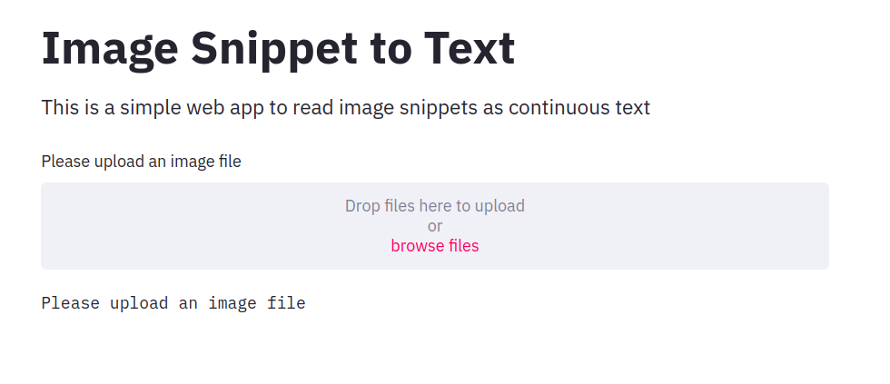

# Snippet to Text Web-app

### Demo

### Interface

### Instructions to Use
The user uploads a text snippet from any document. The app outputs flowing text separated by paragraph breaks.

### Steps to Run Locally on your System
1. `git clone https://github.com/trunc8/snippet-to-text-webapp.git`
2. `sudo apt install tesseract-ocr tesseract-ocr-eng` (Use `.exe` installer for `Tesseract` on Windows)
3. `pip install -r requirements.txt`
4. `streamlit run snippet_to_text_app.py`

### Deployment
The web-app ([link](https://snippet-to-text.herokuapp.com/)) is deployed on a Heroku server and live!  
(The server may take up to 5 seconds to load the page. Heroku restarts the server after periods of inactivity)

### Authors

* **Siddharth Saha** - [trunc8](https://github.com/trunc8)

Created with :heart: by <a href="https://www.linkedin.com/in/sahasiddharth611/">Siddharth</a>
